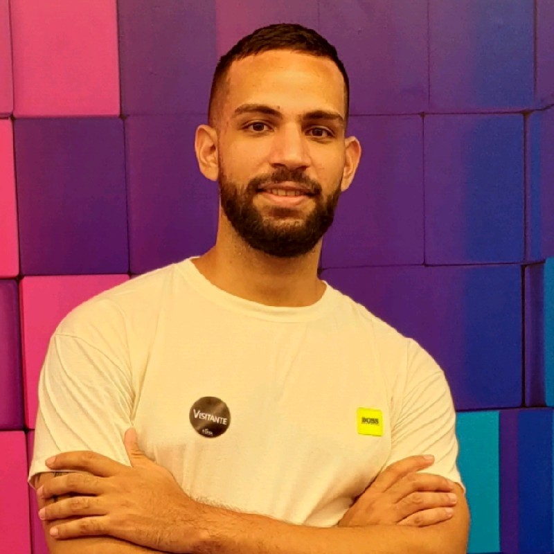

# :bust_in_silhouette: About me

  

<h3>Hello guys! 👋🏼</h3> 

My name is Gabriel and i'm an 24 year old programmer who loves Linux, AI, Backend and Embedded Systems.
   

:newspaper: Gratuated in Electrical Engineering (2017-2021)

:book: MBA in Software and Solutions Architecture (2023)

# :secret: Programming Languages

- C - The first language i've learned, simple and powerful
- C++ - C, but with OOP and some other good stuff
- Rust - The most beloved language
- Python - A simple language with plenty tools

# :wrench: Frameworks and Tools

- LVGL (Graphics Library for Embedded Systems)
- Buildroot (Tool for constructing your own linux distribution)
- Yocto (Another more complex tool to construct your own linux distro)
- Docker (A tool for creating containers, which makes the deployment easier eliminating dependecies)
- Terraform (Tool for automate the deploymet of cloud infraestructure)
- MongoDB and PostgreSQL
